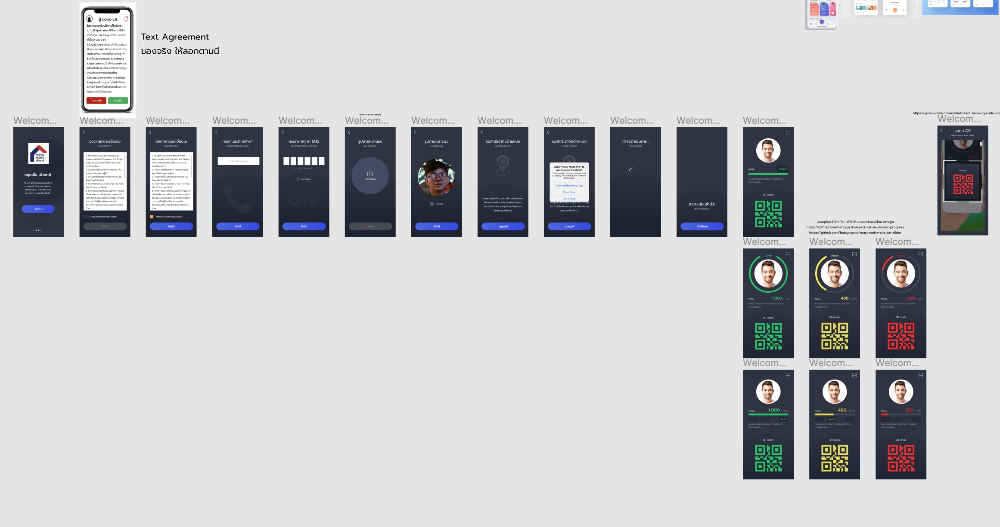

# [Fight Covid-19]
[](https://appcenter.ms/orgs/Squid.id/apps/Squid-Staging/build/branches/staging)
## Getting Started

First follow this instruction to setup react-native https://reactnative.dev/docs/getting-started

### iOS

1. Clone ```git clone https://github.com/Cleverse/fight-covid-19```
2. Install Dependencies `cd fight-covid-19 && yarn && (cd ios; pod install)`
3. Start `npx react-native run-ios`

### Android

1. Clone ```git clone https://github.com/Cleverse/fight-covid-19```
2. Install Dependencies `cd fight-covid-19 && yarn`
3. Start `npx react-native run-android`

## App Flow

https://www.figma.com/file/lZx75oXlD92cikgSNNXvor/%E0%B8%AA%E0%B8%B9%E0%B9%89-Covid-19?node-id=5%3A366

